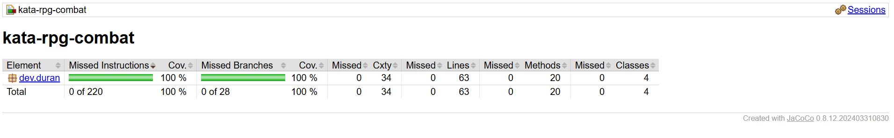
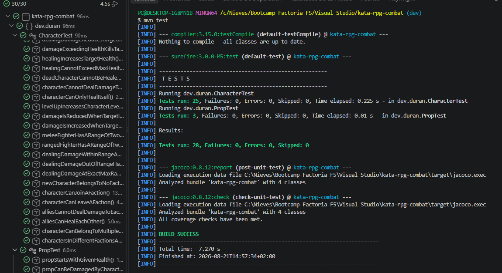

#  Kata RPG Combat

## 🔍 Índice

- [Descripción](#-descripción)
- [Tecnologías utilizadas](#-tecnologías-utilizadas)
- [Instalación](#%EF%B8%8F-instalación)
- [Estructura de carpetas](#-estructura-de-carpetas)
- [Capturas](#-capturas)
- [Autora](#%EF%B8%8F-autora)

---

## 📝 Descripción

Kata para practicar TDD (Test-Driven Development) construyendo las reglas de combate de un juego de rol (RPG). El proyecto no incluye mapa, gráficos ni interfaz jugable: se centra únicamente en la lógica de dominio que decide cómo los personajes se hacen daño, se curan, mueren, se agrupan en facciones y pueden atacar objetos del escenario, siguiendo el ciclo rojo-verde-refactor en cada pequeña funcionalidad.

---

## 💻 Tecnologías utilizadas

- Java 21
- Maven (gestor de dependencias y build)
- JUnit 6.1.3 (framework de tests)
- Hamcrest 2.2 (matchers para aserciones legibles en los tests)
- JaCoCo (informe de cobertura de tests)

---

## 🛠️ Instalación

Clonar el repositorio:


```bash
git clone https://github.com/duran-ni/kata-rpg-combat
cd kata-rpg-combat
```

Descargar las dependencias y compilar el proyecto:

```bash
mvn compile
```

Ejecución de los tests:

```bash
mvn test
```

Tras ejecutar los tests, el informe de cobertura de JaCoCo se genera automáticamente en `target/site/jacoco/index.html`, y se puede abrir directamente en el navegador.
---

## 📁 Estructura de carpetas

```
kata-rpg-combat/
├── docs/
│   ├── tests-coverage.png
│   └── tests-verde.png
├── src/
│   ├── main/java/dev/duran/
│   │   ├── Character.java
│   │   ├── Combatant.java
│   │   ├── FighterType.java
│   │   └── Prop.java
│   └── test/java/dev/duran/
│       ├── CharacterTest.java
│       └── PropTest.java
├── .editorconfig
├── .gitignore
├── pom.xml
└── README.md
```

## 📷 Capturas

### Cobertura de tests con JaCoCo



### Tests en verde



---

## ✍️ Autora

duran-ni
